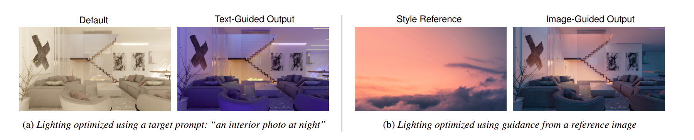
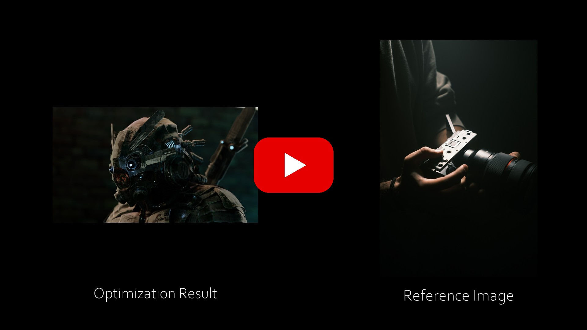

# Differentiable Objectives for 3D Scene Relighting via Gradient Descent on OLAT Basis Coefficients


This repository contains the source code for the 2026 Eurographics Short Paper, _Differentiable Objectives for 3D Scene Relighting via Gradient Descent on OLAT Basis Coefficients_, which describes a method for relighting 3D scenes after rendering by using objectives such as CLIP similarity or NST and adjusting lights to match those objectives.

* Read the short paper [here](https://diglib.eg.org/handle/10.2312/egs20261021).
* Read the entire thesis (which contains additional results and experiments) [here](https://arks.lib.byu.edu/ark:/34234/q2f2b88884).
* Watch the demo video <a href="https://www.youtube.com/watch?v=px7gxgCySMQ" target="_blank" rel="noopener noreferrer">on YouTube</a>:

<div style="text-align: center;">
  <a href="https://www.youtube.com/watch?v=px7gxgCySMQ" target="_blank" rel="noopener noreferrer">
    
  </a>
</div>

## Getting Started
This code was tested with **Python 3.12** and the modules in `requirements.txt`. Install the required dependencies by running:
```bash
pip install -r requirements.txt
```

Check out the example notebooks in the `examples/` directory to get started. 

## Repository Structure
- `examples/` - Example notebooks demoing the use of the optimization framework with various losses
- `losses/` - Loss function objectives (CLIP, SSIM, LPIPS, Aesthetic, etc.)
- `utils/` - Core utility modules (optimization, color conversion, record keeping, etc.) 
  - `external_utilities/` - Standalone tools and helper applications
    - `gallery/`: Web-based Flask gallery application for browsing, filtering, and curating optimization run images (`gallery_app.py`, `templates/`, `static/`). See [`utils/external_utilities/gallery/README.md`](utils/external_utilities/gallery/README.md) for detailed documentation on how to run it.
    - `blender_utils/`: Blender rendering utilities and add-ons (`olat_render_addon.py`) for generating OLAT datasets from 3D scenes.
- `config.py` - Global project configuration settings (including the local directories where optimization results are stored and where model weights are downloaded)